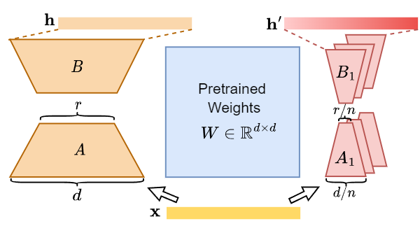

# MELoRA: Mini-Ensemble Low-Rank Adapters for Parameter-Efficient Fine-Tuning

MELoRA, a mini-ensemble low-rank adapters that uses fewer trainable parameters while maintaining a higher rank, thereby offering improved performance potential.The core idea is to freeze original pretrained weights and train a group of mini LoRAs with only a small number of parameters. This can capture a significant degree of diversity among mini LoRAs, thus promoting better generalization ability. 

## Method Overview
<div align=center> 

</div> 

## Quickstart
1. Install dependencies

   ```bash
   conda create -n MELoRA python=3.10
   conda activate MELoRA
   pip install torch==2.0.1
   pip install -r requirements.txt
   ```

   ```bash
   cd peft-0.5.0
   pip install -e .
   ```

2. Run experiments

fill in the `--model_name_or_path` `--wandb_project` and `--output_dir` in `llama_finetune.sh` and `glue_finetune.sh` with the path to the model and the output directory.

### Instruction Tuning
```bash
bash llama_finetune.sh
```

### NLU

```bash
bash glue_finetune.sh
```
## Thanks

Code is largely based on [AGI-Edgerunners/LLM-Adapters](https://github.com/AGI-Edgerunners/LLM-Adapters), [huggingface/peft](https://github.com/huggingface/peft), [huggingface/transformers](https://github.com/huggingface/transformers)
## Cite
If you find this method or code useful, please cite
~~~
@article{melora,
  title={Mini-Ensemble Low-Rank Adapters for Parameter-Efficient Fine-Tuning},
  author={Ren, Pengjie and Shi, Chengshun and Wu, Shiguang and Zhang, Mengqi and Ren, Zhaochun and de Rijke, Maarten and Chen, Zhumin and Pei, Jiahuan},
  journal={arXiv preprint arXiv:2402.17263},
  year={2024}
}
~~~